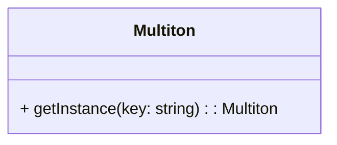
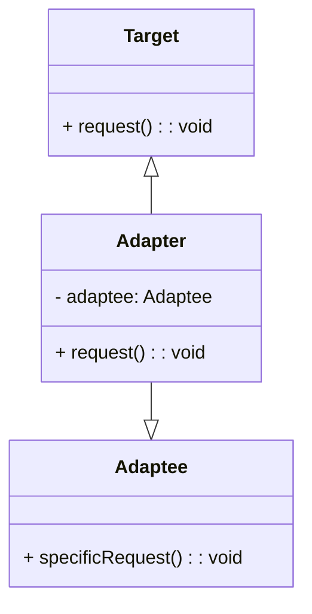
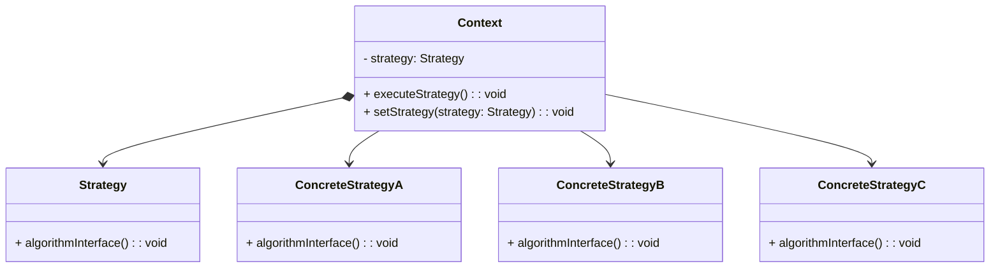
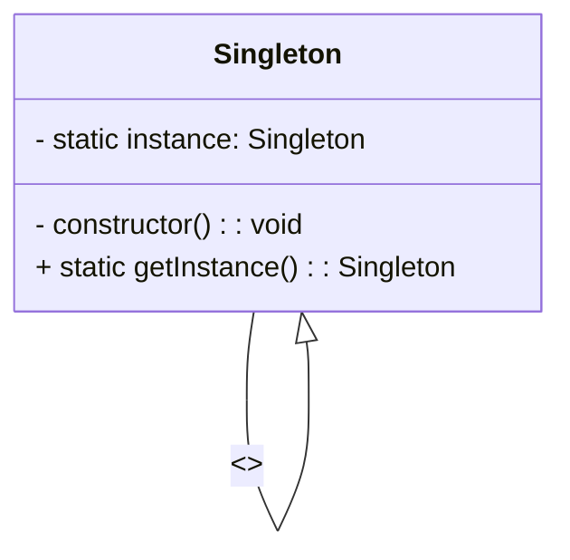

# Design-patterns
Тут знаходяться розглянуті в рамках виконання РГР з дисципліни АППЗ. NET патерни проектування

# Multiton pattern
Опис даного патерну повністю взято з Вікіпедії, за посиланням: [Мультитон (шаблон проєктування) — Вікіпедія (wikipedia.org)](https://uk.wikipedia.org/wiki/%D0%9C%D1%83%D0%BB%D1%8C%D1%82%D0%B8%D1%82%D0%BE%D0%BD_(%D1%88%D0%B0%D0%B1%D0%BB%D0%BE%D0%BD_%D0%BF%D1%80%D0%BE%D1%94%D0%BA%D1%82%D1%83%D0%B2%D0%B0%D0%BD%D0%BD%D1%8F)).

В розробці програмного забезпечення, шаблон проєктування мультитон або пул одинаків схожий на шаблон одинак, який дозволяє створювати лише один екземпляр об’єкта, але розширює його можливістю впорядковувати декілька екземплярів у вигляді іменованих пар ім'я-значення.
Замість того, щоб забезпечувати наявність лише одного об'єкта в програмі, мультитон гарантує існування лише одного входження з відповідним ключем.

Мультитон можна використовувати в випадку, коли необхідно забезпечити доступ до конкретного набору даних із різних місць програми. Інший випадок - взаємодія з апаратним обладнанням через екземпляри одного і того самого класу. Наприклад, обмін даними з мережею контролерів, опитування серверів або робочих станцій в мережі. Всі ці приклади об'єднує одне: кількість екземплярів може бути обмежена (і навіть повинна бути обмежена) і вони глобальні для всієї програми.
Даний шаблон можна розглядати навіть як об'єднання ідеї шаблону одинака і пулу об'єктів. Виходячи з цього можна визначити його властивості:
•	Шаблон можна застосовувати як із заздалегідь визначеним списком екземплярів, так і створеним динамічно.
•	Якщо список фіксований, то можливо створити всі екземпляри при старті програми або при зверненні до будь-якого з них.
•	Можливо два варіанти поведінки у відповідь на запит екземпляра з невідомим ідентифікатором: відмова або його створення.
•	Недоліком шаблона, є можливість появи великої кількості залежних від нього частин програми. Однак, у випадку з одинаком, це можна вирішити шляхом використання методу впровадження залежностей.

# Adapter pattern
Опис даного патерну повністю взято з Вікіпедії, за посиланням: [Адаптер (шаблон проєктування) — Вікіпедія (wikipedia.org)](https://uk.wikipedia.org/wiki/%D0%90%D0%B4%D0%B0%D0%BF%D1%82%D0%B5%D1%80_(%D1%88%D0%B0%D0%B1%D0%BB%D0%BE%D0%BD_%D0%BF%D1%80%D0%BE%D1%94%D0%BA%D1%82%D1%83%D0%B2%D0%B0%D0%BD%D0%BD%D1%8F)).

Адаптує інтерфейс одного класу в інший, очікуваний клієнтом. Адаптер забезпечує роботу класів з несумісними інтерфейсами, та найчастіше застосовується тоді, коли система підтримує необхідні дані і поведінку, але має невідповідний інтерфейс.
Адаптер передбачає створення класу-оболонки з необхідним інтерфейсом.
Клас Adapter приводить інтерфейс класу Adaptee у відповідність з інтерфейсом класу Target (спадкоємцем якого є Adapter). Це дозволяє об'єктові Client використовувати об'єкт Adaptee так, немов він є екземпляром класу Target.
Шаблон Адаптер дозволяє включати вже наявні об'єкти в нові об'єктні структури, незалежно від відмінностей в їхніх інтерфейсах.
Переваги:
-	Допомагає досягти багаторазового використання та гнучкості.
-	Клас клієнта не ускладнюється необхідністю використовувати інший інтерфейс і може використовувати поліморфізм для обміну між різними реалізаціями адаптерів.
Недоліки:
-	Всі запити пересилаються, тому спостерігається незначне збільшення накладних витрат.
-	Іноді багато адаптацій потрібні по ланцюгу адаптера, щоб досягти потрібного типу.

# Strategy pattern
Опис даного патерну повністю взято з Вікіпедії, за посиланням: [Стратегія (шаблон проєктування) — Вікіпедія (wikipedia.org)/](https://uk.wikipedia.org/wiki/%D0%A1%D1%82%D1%80%D0%B0%D1%82%D0%B5%D0%B3%D1%96%D1%8F_(%D1%88%D0%B0%D0%B1%D0%BB%D0%BE%D0%BD_%D0%BF%D1%80%D0%BE%D1%94%D0%BA%D1%82%D1%83%D0%B2%D0%B0%D0%BD%D0%BD%D1%8F))

Стратегія (англ. Strategy) — шаблон проєктування, належить до класу шаблонів поведінки. Відомий ще під іншою назвою — «Policy». Його суть полягає у тому, щоб створити декілька схем поведінки для одного об'єкту та винести в окремий клас. Шаблон Стратегія (Strategy) дозволяє міняти вибраний алгоритм незалежно від об'єктів-клієнтів, які його використовують.
-	Клас Strategy визначає, як будуть використовуватися різні алгоритми.
-	Конкретні класи ConcreteStrategy реалізують ці різні алгоритми.
-	Клас Context використовує конкретні класи ConcreteStrategy за допомогою посилання на конкретний тип абстрактного класу Strategy.
Класи Strategy і Context взаємодіють з метою реалізації обраного алгоритму (в деяких випадках класу Strategy потрібно надсилати запити класу Context). Клас Context пересилає класу Strategy запит, що надійшов від його класу-клієнта.

# Double-checked locking pattern
Опис даного патерну взято і перекладено мною з Вікіпедії, за посиланням: https://en.wikipedia.org/wiki/Double-checked_locking .

Даний патерн відноситься до шаблонів багатопотокового програмування, а його основна мета полягає у зменшенні накладних витрат, пов’язаних із отриманням блокування. Спочатку перевіряється умова блокування без будь-якої синхронізації, а далі потік робить спробу отримати блокування, тільки якщо результат перевірки свідчить про необхідність блокування.
Безпечна реалізація даного патерну деякими мовами не є можливою, тому його ще іноді називають анти-патерном.
Зазвичай він використовується для зменшення накладних витрат при реалізації лінивої ініціалізації у багатопотокових програмах, наприклад, у складі патерну Сінглтон (Одинак). Під час лінивої ініціалізації змінної, сама ініціалізації відтерміновується до того часу, поки це значення не знадобиться у розрахунках.

